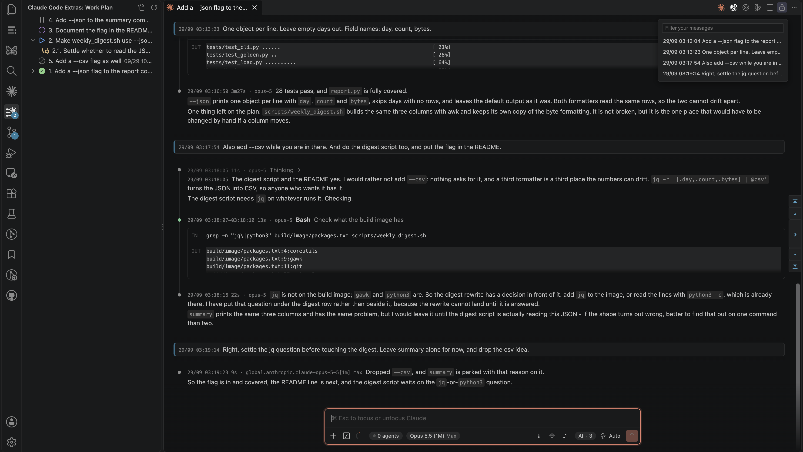
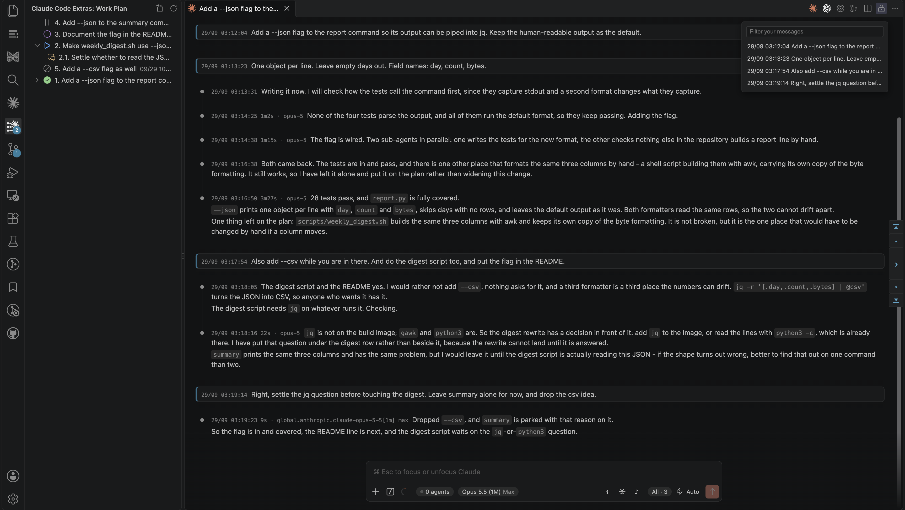

# Extras for Claude Code

This VS Code extension edits the installed Claude Code extension to add a Claude-maintained work plan to its chat panel. The plan keeps unfinished work on screen and puts it back in front of Claude after older turns are compacted. It also adds timestamps; reply duration, context use, running spend, and model; a filterable table of contents with message stepping; a context meter with a hover breakdown; sub-agent tags and filters; a fold for thinking and tool calls; chimes; and session details.
Not affiliated with Anthropic. Requires Anthropic's Claude Code extension, which it adds nothing without, and VS Code 1.94 or later. 23 settings, 11 commands.

Discuss tasks in parallel threads: you can raise a new topic before finishing another, without starting a separate conversation for each task. Keep several tasks open and discuss them by row number, in any order: `122: try another icon`, `101.1: not now`. One message can settle several rows, and you can return to a row hours later. The plan is a tree of remaining work. Numbers mark positions in its file and stay fixed when finished rows leave gaps. They appear in the activity-bar tree and the open rows shown to Claude every turn, even after compaction. Claude records decisions on each row: approval makes it `todo`, rejection `dropped`, and deferral `parked`.

## Install

Search for **Extras for Claude Code** in the Extensions view, or run
`code --install-extension xnervwang.claude-code-extras`. Anthropic's Claude Code extension installs
as a dependency.

Reload the VS Code window twice after installing. Run
`Extras for Claude Code: Show Status` for the patch status. In a Remote SSH window, install on the
remote.

Extras for Claude Code edits files inside the installed Claude Code extension. The patch is reverted
by removing it or uninstalling the extension; a Claude Code build it does not recognise is left
alone with a warning.

Verified against Claude Code 2.1.288, 2.1.289, 2.1.291 and 2.1.292; compatibility with other builds unknown.

## Work plan

The work plan is a tree of what the conversation you are looking at still has to do, in its own activity-bar view. Compaction summarizes older turns to fit the context window, so Claude can lose track of the main task after several digressions. The plan stays in a file outside the conversation, named for its session ID, and a hook injects the open rows every turn: a task raised twenty turns and several compactions ago remains in front of Claude and visible in the plan's activity-bar view.

Claude keeps the plan current; you do not. The extension ships a Claude Code plugin, installed on first activation, that writes it. Every turn, the plugin puts open rows in front of the model, including how long `doing` and `waiting` rows have been in that state when a time is recorded. It also gives Claude the full command line for `plan-row.py`, a small command shipped with the plugin. Claude uses it to change a row or add one; the command gets times from the clock. The plugin says something at the end of a turn that changed things without touching the plan, and refuses a row whose description is longer than the view shows. After a batch of tool calls, it also reminds Claude to mark the row it is working on, once per turn, if the main thread has made at least three tool calls or changed at least two things besides the plan, and no row is marked `doing`. A new request becomes `discussing`, unless you asked for work that Claude starts now: that goes straight to `doing`. A request to look into something gets its own row, `doing` while Claude looks and `done` when it answers; possible follow-up work goes in as `discussing`. Approval makes a row `todo`; starting work makes it `doing`, before the work; finishing makes it `done`. A started row held up by someone or something outside the conversation becomes `waiting`, with what it waits on in its note, and remains open. A decision against a row makes it `dropped` with the reason; leaving it for later makes it `parked` with the reason.

If A needs B finished first, B becomes a child of A: a digression sits under the thing it interrupted. Rows have numbers such as 1, 2, and 2.1, so you can name one in conversation without quoting its title. The number is its place in the file; finishing a row leaves a gap rather than renumbering what follows. Unfinished rows appear first, newest first within that. The activity-bar badge counts `discussing` and `todo` rows and is absent, rather than zero, when there are none.

Each conversation has one file, named by session ID, under `~/.claude/plugins/data/agent-work-plan-claude-code-extras/`. The view reads those files; the extension never writes them. Correct a plan by hand from the title-bar button or a row's context menu. A plan belongs to one conversation: in-process sub-agents are not covered, and a detached agent is handed one task and left alone.

## What it looks like

The work plan on the left, times on every message and reply, the table of contents at the right
edge, and the footer controls. Thinking and tool calls shown, which is the default:

The same conversation with one footer button pressed, leaving your messages and Claude's replies:

## Features

| What it shows | Where it appears |
| --- | --- |
| **Timestamps:** transcript times; `start→result` for tool calls; clock today; day and month for older entries; original times in reopened history | Messages, reply blocks, tool calls |
| **Reply figures:** `2m10s · ctx 33% · cost $0.42 · opus-5 high`; turn duration, context-window use, running spend, and the model and effort the reply was sent with | Each reply, including closed turns |
| **Sub-agent tags and filters:** spawn descriptions, such as `#look up tomorrow's weather`; `All`, `Main`, and individual sub-agent filters; table of contents follows filter | Tags on rows; filters in footer |
| **Conversation navigation:** message times, opening words, compaction points; filter box; click-to-scroll; message stepping with arrows, `,`, and `.`; top and bottom jumps | Right-edge table of contents; buttons |
| **Conversation only:** thinking and tool calls folded away; while a turn runs, the latest tool call at the end of the working indicator's line, such as `Bash running for 2m55s (since 11:11:18)` or `last tool Bash finished 35s ago (11:14:13)` | Footer button; the working indicator's line |
| **Context meter:** visible even with over half the window free; outline at 15% remaining; category, memory-file, and custom-agent breakdown | Chat panel meter; hover tooltip |
| **Session dates:** `11d · 09/05→09/16`; Claude Code relative last-active time, followed by date span | Sessions |
| **Chimes:** two rising notes, three knocks, two falling notes; synthesized sound; no shipped audio files; footer mute button | Finished turn, permission request, question; local panel, including Remote SSH; footer |
| **Work plan:** see [Work plan](#work-plan) | Activity-bar view |
| **Background sessions:** `claude --bg` sessions this conversation started; running, waiting for you, done, stopped or failed; progress line, what it is waiting for, final result, the task it was given; copy the attach or logs command | Agents button in the footer, and its map |
| **Session information:** session ID, starting directory, transcript location and size; click-to-copy values | Footer button and session information |

## Settings

Open `Extras for Claude Code: Settings` for the settings UI. Options cover message times, reply
figures, sub-agent tags, navigation, footer controls, sounds, session details, background sessions, the work plan
and its offer thresholds, and panel-opening latency recording. Message appearance:
`claudeCodeExtras.userMessageColor` and `claudeCodeExtras.userMessageEdge`.

Most settings apply live without a reload; installing or upgrading the patch requires a reload.

Turning `claudeCodeExtras.enabled` off stops the additions from appearing in the panel, but it does
not undo the patch. The patch stays in Claude Code's installed files, and the injected script, its
poll, and the hooks keep running. To restore the original files, run
`Extras for Claude Code: Remove from Claude Code (restore original files)` or uninstall this
extension.

Turning off `claudeCodeExtras.workPlan` hides the view and stops plan updates. The registered
plugin's skill description still loads in Claude Code; use
`Extras for Claude Code: Stop Loading the Work Plan Plugin` to stop loading it.

## Commands

| Command | What it does |
| --- | --- |
| `Extras for Claude Code: Settings` | Open this extension's VS Code settings |
| `Extras for Claude Code: Toggle On/Off` | Toggle additions |
| `Extras for Claude Code: Turn On` | Show additions |
| `Extras for Claude Code: Turn Off` | Hide additions |
| `Extras for Claude Code: Remove from Claude Code (restore original files)` | Restore original files |
| `Extras for Claude Code: Show Status` | Report patch status and what was patched |
| `Extras for Claude Code: Refresh Work Plan` | Refresh work plan |
| `Extras for Claude Code: Open the Work Plan File` | Open current plan file |
| `Extras for Claude Code: Install the Work Plan Plugin for Claude Code` | Register companion plugin |
| `Extras for Claude Code: Show How Long Opening a Panel Took` | Read recorded panel-opening times |
| `Extras for Claude Code: Stop Loading the Work Plan Plugin` | Remove plugin from Claude Code settings |

## Known limits

- Patched code shapes with renamed CSS classes: panel features may fail; orange exclamation
  mark at the panel's top right.
- Uninstallation unregisters the plugin: Claude Code deletes its data directory; plans copied
  beforehand to `~/.claude/agent-work-plan-plans-<timestamp>/`.
- Disabling the extension, as opposed to uninstalling it, leaves the patch in place. Run
  `Extras for Claude Code: Remove from Claude Code (restore original files)` first.

## Contributing

See [CONTRIBUTING.md](CONTRIBUTING.md) for the layout, checks, and verified-build records.

## License

BSD 3-Clause.
